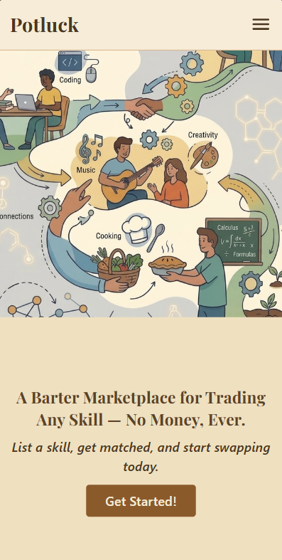
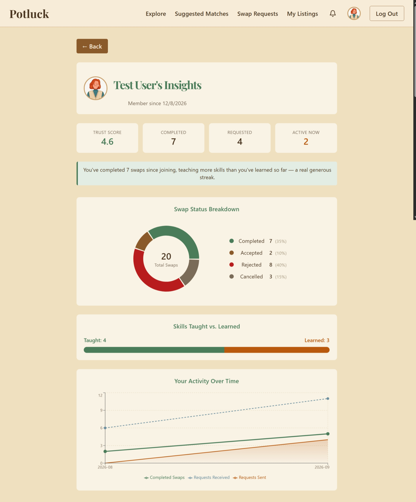
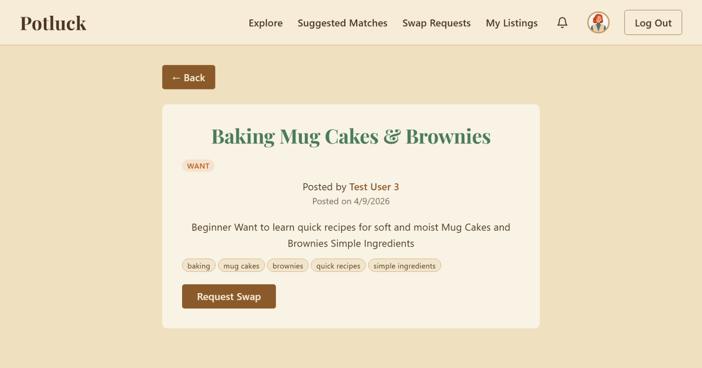

# Potluck

**A barter marketplace for trading any skill — no money, ever.**

Potluck is a full-stack web platform where people list skills they can teach and skills they want to learn — cooking, coding, music, tutoring, fitness, anything — and get intelligently matched with others nearby, with a built-in trust system to make the exchange feel safe.

🔗 **Live app:** [potluck-puce.vercel.app](https://potluck-puce.vercel.app)

---

## The problem

Skill-swapping already happens — informally, through WhatsApp groups, Instagram stories, and word of mouth. But there's no way to search for the right person, no way to know if they're reliable, and no structure once you find them.

Potluck gives that exchange a real home: searchable listings, intelligent matching, a swap negotiation flow, and a visible trust score built from completed exchanges.

## Screenshots

| Home | Dashboard |
|---|---|
|  |  |



---

## Core features

- **Any-skill listings, AI-assisted** — describe a goal in plain language ("I want to make a website") and AI breaks it into structured, taggable skills. The user reviews and edits every AI suggestion before it's posted.
- **Hybrid smart matching** — exact tag matches are scored instantly for free; an AI relatedness check only runs for the harder, no-exact-match cases (e.g. "baking" ↔ "cooking"), keeping the matching engine fast and cheap.
- **Full swap negotiation flow** — request → share offer listings → pick → confirm, with automatic 7-day expiry on unanswered requests and a fallback to a simple accept/reject when there's nothing to negotiate.
- **Trust & reputation system** — every completed swap can be rated (with an optional written review and a "helpful" vote), building a visible trust score on each profile.
- **In-app notifications** — new requests, turn-based stage changes, completions, ratings, and swap acceptance, plus live-computed expiry reminders, via a bell-icon dropdown.
- **Personal dashboard** — trust score, completed/pending swap breakdown, skills taught vs. learned, and an activity chart over time.
- **Real email delivery** — password reset and email verification links are sent via a real transactional email service, with all the standard security practices (single-use tokens, expiry windows, no email-enumeration leaks).
- **Illustrated avatars** — every user gets a deterministic default avatar, with a full picker to choose one of 18.

## Tech stack

| Layer | Choice |
|---|---|
| Frontend | React 18 + Vite, TypeScript, Tailwind CSS |
| Backend | Node.js + Express, TypeScript (REST API) |
| Database | MongoDB Atlas + Mongoose |
| Auth | JWT + bcrypt |
| AI integration | Groq API (Llama-family model), OpenAI-compatible SDK — skill extraction + relatedness scoring |
| Email | Resend — password reset and email verification |
| Charts | Recharts |
| Hosting | Vercel (frontend), Render (backend), MongoDB Atlas (database) |


## AI integration, explained plainly

Two things use AI in this app, and both are deliberately **hybrid**, not AI-first:

1. **Skill tagging at listing creation** — when someone writes a free-text goal ("I want to make a website"), the backend sends it to Groq's API and gets back a structured list of underlying skills. The user always reviews and can edit these before posting — AI assists, it doesn't have the final say.
2. **Matching relatedness** — the matching engine scores exact tag overlaps first, for free, with no API call. Only when there's no exact match does it call the AI to judge whether two differently-worded skills are actually related (e.g. "baking" and "cooking"). This keeps the common case fast and free, and reserves the API call for where it actually adds value.

**Graceful degradation is built in throughout:** free-tier AI APIs are rate-limited by design, and that's treated as an expected condition, not an edge case. If either AI call fails, the app falls back to manual tagging or exact-match-only scoring — it never breaks the underlying feature.

## Running it locally

**Prerequisites:** Node.js, a MongoDB Atlas connection string, a free Groq API key, a free Resend API key.

```bash
# Clone the repo
git clone https://github.com/Vertika1711/potluck.git
cd potluck

# Backend
cd backend
npm install
# create a .env file with MONGODB_URI, JWT_SECRET, GROQ_API_KEY,
# RESEND_API_KEY, FRONTEND_URL=http://localhost:5173
npm run dev

# Frontend (in a separate terminal)
cd frontend
npm install
# create a .env file with VITE_API_URL=http://localhost:5000
npm run dev -- --host
```

The frontend runs at `http://localhost:5173`, the backend at `http://localhost:5000`.

## Known limitations

- Matching relies on a third-party free-tier LLM API — rate limits or provider changes could disrupt AI tagging/relatedness scoring, which is why both fall back to manual/exact-match behavior rather than failing outright.
- Sessions happen off-platform (a call, a video chat, an in-person meetup) — Potluck can only confirm both sides said a swap happened, not that it did.
- Ratings aren't fraud-proof — two colluding users could theoretically inflate each other's trust score.
- Not load-tested beyond a small community scale.
- Render's free tier spins down after 15 minutes of inactivity, so the first request after a period of no traffic can take 30–50 seconds to respond.

## What's deliberately out of scope, and why

- **Hosting the actual lesson/session** (video, calling, screen share) inside Potluck — this would mean duplicating what Zoom/Meet/a phone call already does well, far beyond this project's scope.
- **Training a custom ML model** for tagging or matching — an existing free-tier LLM API already provides this well enough; training and hosting a custom model would need labeled data this project doesn't have.
- **Payments or escrow** — Potluck is a pure barter system by design, not by limitation.

---

Built as a full-stack learning project, from schema design through deployment.